# 图像降噪实验报告

> 元凯文 200110213


## 一 、任务描述

利用400张无噪声图像和对应的400张加性白噪声图像（噪声水平25）训练图像降噪模型，最后利用12张同等噪声水平图像对模型进行测试。

## 二 、 模型实现方案

采用 [DnCNN-S](reference/Beyond a Gaussian Denoiser-Residual Learning of Deep CNN for Image Denoising.pdf) 网络模型：


给定深度为D的DnCNN，由三种类型的层，展示在图中有三种不同的颜色。

(i) **Conv+ReLU**：对于第一层，使用64个大小为 $3\times3\times c$ 的滤波器被用于生成64个特征图。然后将整流的线性单元 $( ReLU , max(0,·) )$ 用于非线性。这里的c代表着图像的通道数，即c=1时为灰色图像，c=3时为彩色图像。

(ii) **Conv+BN+ReLU**：对应于层 $2~(D-1)$ ，使用64个大小 $3\times 3\times 64$ 的过滤器，并且将批量归一化加在卷积和$ReLU$之间。

(iii) **Conv**：对应于最后一层，c个大小为 $3\times 3\times 64$ 的滤波器被用于重建输出。

### 1. 残差学习

不同于一般残差学习每隔两层即插入捷径的做法，此模型直接将网络的输出改成残差图像，优化目标不是真实图片与网络输出之间的均方误差，而是真实残差图片与网络输出之间的均方误差。

### 2. 批量标准化

此模型在 $2 ~ (D-1)$ 卷积层之后加入了批量标准化，有效解决了内部协变量移位问题，加快了训练速度。

### 3. 感受野

网络层数为 $d$ 时，此网络模型的感受野为 $(2d+1) \times  (2d+1)$

### 4. Adam优化

此模型的backward过程使用了Adam优化算法，避免对称性对SGD的限制，同时加快了训练速度。


## 三 、 模型训练与测试

### 1. 超参数设置

| 批量大小 | 网络深度 | 训练周期数 | 学习率衰减时机（周期数） | 初始学习率 | 衰减后学习率 | 噪声水平 |
| -------- | -------- | ---------- | ------------------------ | ---------- | ------------ | -------- |
| 64       | 17       | 50         | 30                       | 1e-3       | 1e-4         | 25       |

### 2. 数据预处理

通过裁切、翻转、旋转等手段对400张原训练图像进行了增广，共计获得238000个训练样本

### 3. 训练结果

PSNR随训练周期变化在验证集上的表现：


最后一个周期时在验证集上的表现：

                        

### 4. 测试结果

| 序号 |       原图像              噪声图像            去噪图像       |  PSNR   |  SSIM  |
| :--: | :----------------------------------------------------------: | :-----: | :----: |
|  1   | 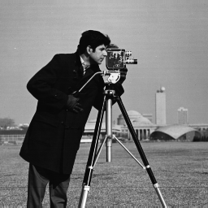  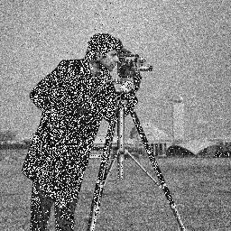  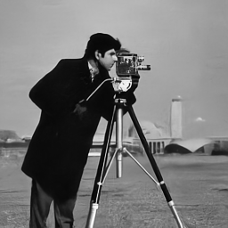 | 30.0083 | 0.8667 |
|  2   |   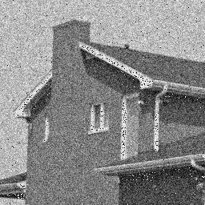  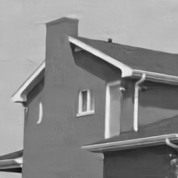 | 33.0902 | 0.8594 |
|  3   | 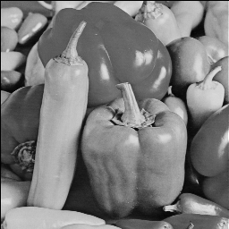  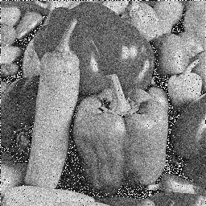   | 30.7628 | 0.8812 |
|  4   |   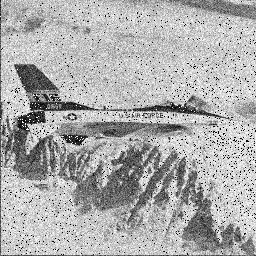  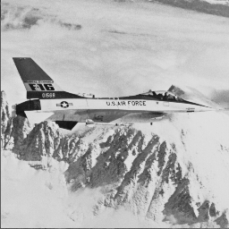 | 29.4847 | 0.8752 |
|  5   |   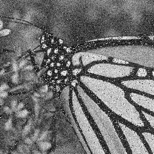   | 30.3625 | 0.9191 |
|  6   | 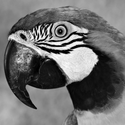  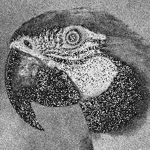   | 29.0700 | 0.8717 |
|  7   |   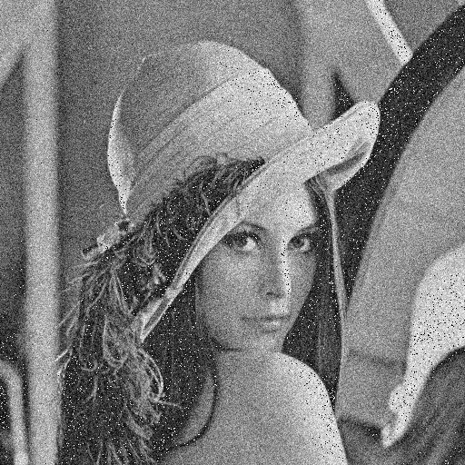  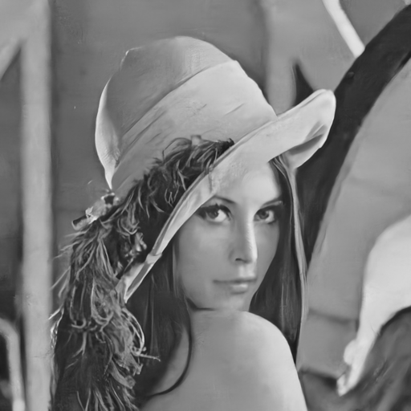 | 29.3707 | 0.8646 |
|  8   |   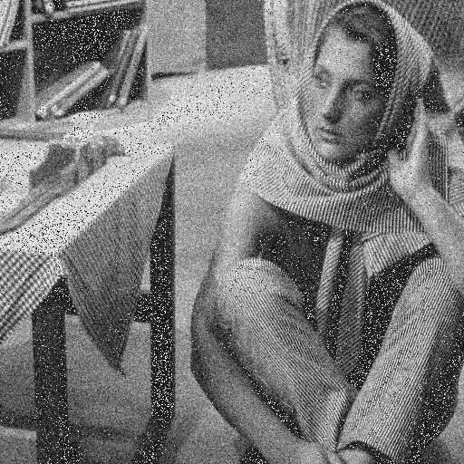  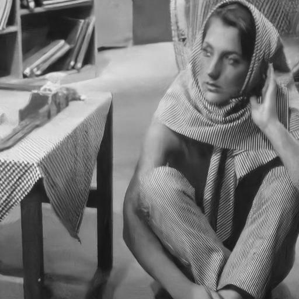 | 32.3816 | 0.8682 |
|  9   |     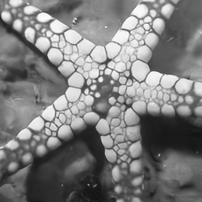 | 29.9418 | 0.8786 |
|  10  |   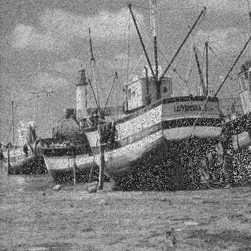   | 30.1792 | 0.8119 |
|  11  |   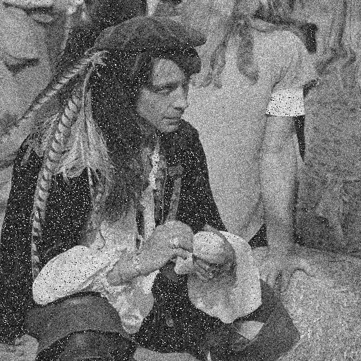  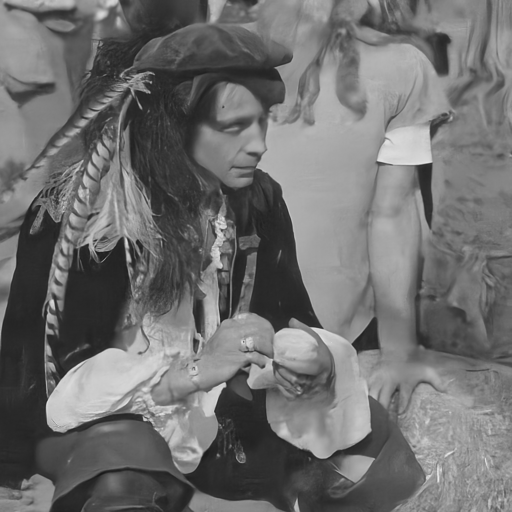 | 30.0528 | 0.8222 |
|  12  |   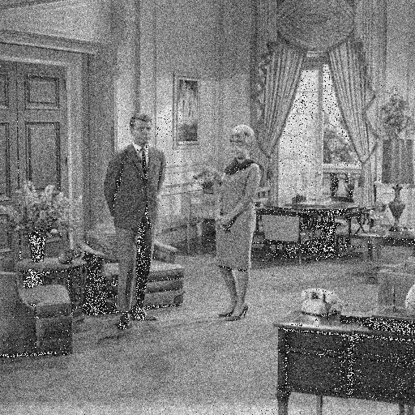  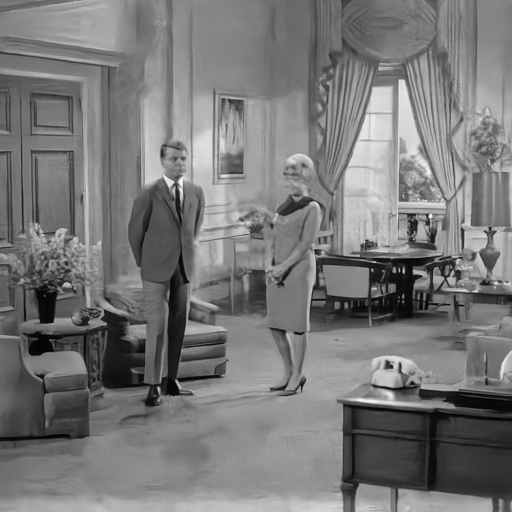 | 30.0758 | 0.8309 |
| 平均 |                                                              | 30.3984 | 0.8625 |


详细训练和测试结果参见logs文件：

```shell
cd src

# 查看训练结果
tensorboard --logdir=train_logs

# 查看测试结果
tensorboard --logdir=test_logs
```

## 四 、 总结

对比原图像和降噪后图像，发现降噪后图像在细节上过于光滑，原图像的纹理和细节在某种程度上被当做噪声一并抹平了，因此我觉得降噪算法的下一个突破点可能是寻找某种机制来恢复原图像的纹理。不同图像的纹理自然不同，但就同一张图片，或者图片中的某个局部而言，重复性纹理经常会出现（比如测试集中的第2号图片的砖纹），这种重复构成了规律，或者说模式，具有被神经网络捕捉和学习的可能性。将输入的图片分别经过降噪模型和纹理识别模型处理，综合二者的结果，或许能够得到与原图像相似度更高的降噪图像。
